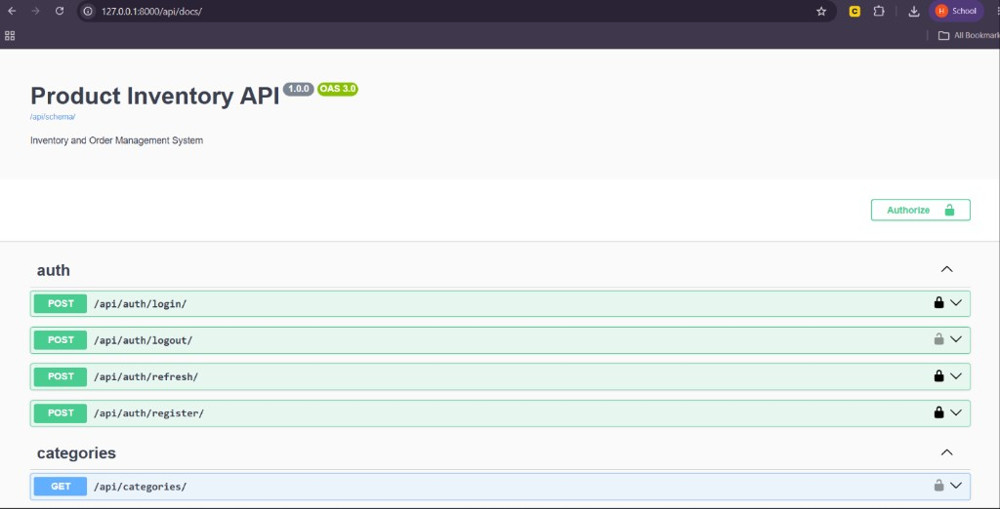
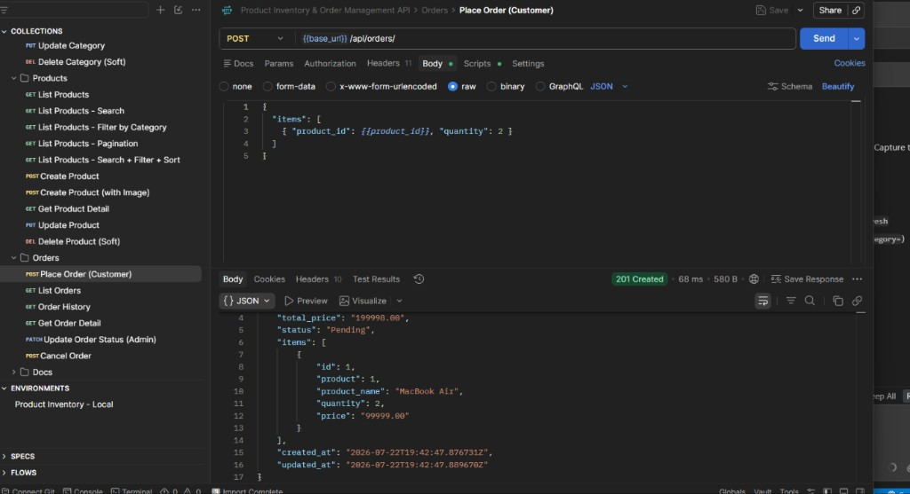
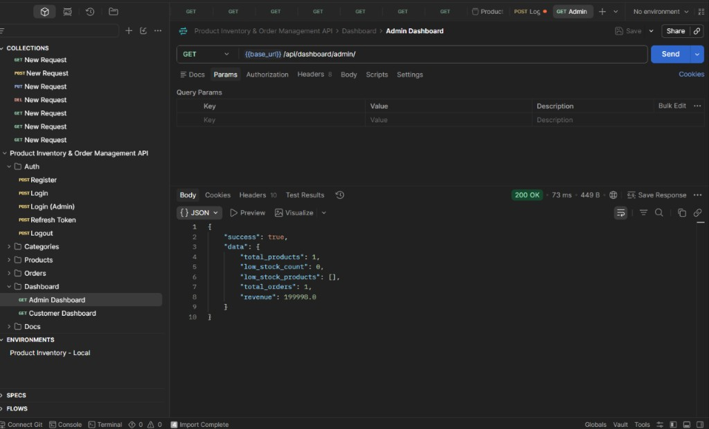
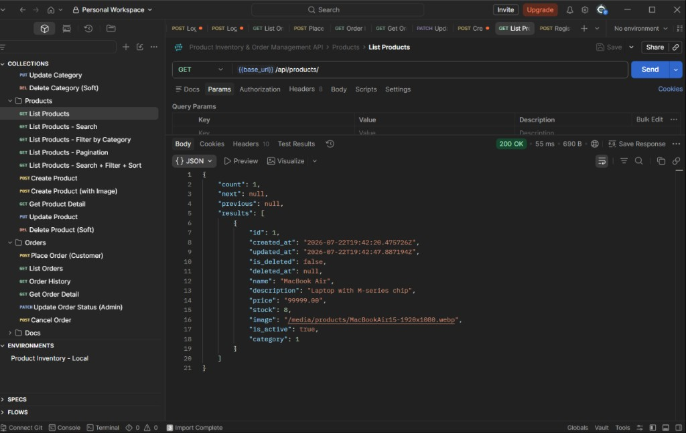

# Product Inventory & Order Management System (Backend)

Django REST Framework API for inventory management, JWT authentication, order placement with stock transactions, and admin/customer dashboards.

## Tech Stack

- **Backend:** Django 6 + Django REST Framework  
- **Auth:** JWT (`djangorestframework-simplejwt`)  
- **Database:** PostgreSQL  
- **Docs:** Swagger / OpenAPI (`drf-spectacular`)  
- **Filtering:** `django-filter`  
- **Images:** Pillow  

## Features

- JWT register / login / refresh / logout  
- Admin: categories & products CRUD (including stock & soft delete)  
- Customer: view products, search, filter, pagination  
- Place order with atomic stock validation & reduction  
- Order history, status update, cancel (restores stock)  
- Admin & customer dashboards  
- Swagger UI + Postman collection  
- Docker / Docker Compose support  
- CSV export for products and orders (admin)  

## Project Structure

```
product-inventory-system_Backend/
├── config/           # Django settings & root URLs
├── users/            # Auth (register, login, refresh, logout)
├── categories/       # Category APIs
├── products/         # Product APIs
├── orders/           # Order APIs + stock transactions
├── dashboard/        # Admin & customer dashboards
├── postman/          # Postman collection & environment
├── media/            # Uploaded product images
├── Dockerfile
├── docker-compose.yml
├── entrypoint.py
├── .env.example      # Sample environment variables
├── requirements.txt
└── manage.py
```

## Prerequisites

- Python 3.11+ (recommended)  
- PostgreSQL running locally  
- `pip` / virtualenv  

## Setup Instructions

### 1. Clone & create virtual environment

```bash
git clone <your-repo-url>
cd product-inventory-system_Backend

python -m venv venv

# Windows
venv\Scripts\activate

# macOS / Linux
source venv/bin/activate
```

### 2. Install dependencies

```bash
pip install -r requirements.txt
```

### 3. Configure environment

```bash
cp .env.example .env
```

Edit `.env` if needed:

```env
SECRET_KEY=django-insecure-change-me-in-production
DEBUG=True
ALLOWED_HOSTS=localhost,127.0.0.1

DB_NAME=product_inventory
DB_USER=postgres
DB_PASSWORD=password
DB_HOST=localhost
DB_PORT=5432
```

### 4. Create PostgreSQL database

Using `psql` or any GUI (pgAdmin):

```sql
CREATE DATABASE product_inventory;
```

Default connection used in this project:

| Setting  | Value              |
|----------|--------------------|
| Host     | `localhost`        |
| Port     | `5432`             |
| User     | `postgres`         |
| Password | `password`         |
| Database | `product_inventory`|

### 5. Run migrations

```bash
python manage.py migrate
```

### 6. Create admin user

```bash
python manage.py createsuperuser
```

Use an admin account with `is_staff=True` for product/category management.

Example (if you match the Postman env):

- Username: `admin@yopmail.com`  
- Password: `Welcome@123`  

### 7. Start the server

```bash
python manage.py runserver
```

API base URL: `http://127.0.0.1:8000/`

- Swagger UI: http://127.0.0.1:8000/api/docs/  
- OpenAPI schema: http://127.0.0.1:8000/api/schema/  
- Django admin: http://127.0.0.1:8000/admin/  

## Docker Setup (optional)

Requires Docker Desktop.

```bash
# Ensure .env exists (copy from .env.example)
cp .env.example .env

# Build and start API + PostgreSQL
docker compose up --build
```

Services:

| Service | URL / Port |
|---------|------------|
| API | http://127.0.0.1:8000 |
| PostgreSQL | `localhost:5432` |

Create a superuser inside the running container:

```bash
docker compose exec web python manage.py createsuperuser
```

Stop:

```bash
docker compose down
```

> **Note:** If you already run PostgreSQL on host port `5432`, stop it first or change the host port mapping in `docker-compose.yml` (e.g. `"5433:5432"`).

## Authentication

1. Register a customer:

```http
POST /api/auth/register/
Content-Type: application/json

{
  "username": "customer1",
  "email": "customer1@example.com",
  "password": "pass1234",
  "password2": "pass1234"
}
```

2. Login:

```http
POST /api/auth/login/
Content-Type: application/json

{
  "username": "customer1",
  "password": "pass1234"
}
```

Response includes `access` and `refresh` tokens.

3. Send authenticated requests with:

```http
Authorization: Bearer <access_token>
```

4. Refresh / logout:

```http
POST /api/auth/refresh/
{ "refresh": "<refresh_token>" }

POST /api/auth/logout/
Authorization: Bearer <access_token>
{ "refresh": "<refresh_token>" }
```

## API Overview

### Auth

| Method | Endpoint | Access |
|--------|----------|--------|
| POST | `/api/auth/register/` | Public |
| POST | `/api/auth/login/` | Public |
| POST | `/api/auth/refresh/` | Public |
| POST | `/api/auth/logout/` | Authenticated |

### Categories

| Method | Endpoint | Access |
|--------|----------|--------|
| GET | `/api/categories/` | Authenticated |
| POST | `/api/categories/` | Admin |
| GET | `/api/categories/<id>/` | Authenticated |
| PUT | `/api/categories/<id>/` | Admin |
| DELETE | `/api/categories/<id>/` | Admin (soft delete) |

### Products

| Method | Endpoint | Access |
|--------|----------|--------|
| GET | `/api/products/` | Authenticated |
| POST | `/api/products/` | Admin |
| GET | `/api/products/export/` | Admin (CSV download) |
| GET | `/api/products/<id>/` | Authenticated |
| PUT | `/api/products/<id>/` | Admin |
| DELETE | `/api/products/<id>/` | Admin (soft delete) |

**Query params (list):**

- `?search=laptop` — name search  
- `?category=1` — filter by category id  
- `?page=1` — pagination  
- `?sort=-price` — ordering  

**Create product (JSON):**

```json
{
  "category": 1,
  "name": "iPhone 15",
  "description": "Smartphone",
  "price": "79999.00",
  "stock": 25,
  "is_active": true
}
```

Image upload: use `multipart/form-data` with an `image` file field.

### Orders

| Method | Endpoint | Access |
|--------|----------|--------|
| POST | `/api/orders/` | Customer |
| GET | `/api/orders/` | Customer (own) / Admin (all) |
| GET | `/api/orders/history/` | Authenticated (own) |
| GET | `/api/orders/export/` | Admin (CSV download) |
| GET | `/api/orders/<id>/` | Owner / Admin |
| PATCH | `/api/orders/<id>/status/` | Admin |
| POST | `/api/orders/<id>/cancel/` | Owner / Admin |

**Place order:**

```json
{
  "items": [
    { "product_id": 1, "quantity": 2 },
    { "product_id": 3, "quantity": 1 }
  ]
}
```

**Business rules:**

- Stock is checked before creating the order  
- Ordering is blocked if stock is `0` or quantity exceeds available stock  
- Uses `transaction.atomic()` + `select_for_update()`  
- Stock decreases on successful order  
- Total price is calculated automatically  
- Cancel restores stock  

**Update status (admin):**

```json
{ "status": "Processing" }
```

Allowed statuses: `Pending`, `Processing`, `Completed`, `Cancelled`

### Dashboards

| Method | Endpoint | Access |
|--------|----------|--------|
| GET | `/api/dashboard/admin/` | Admin |
| GET | `/api/dashboard/customer/` | Customer |

**Admin dashboard returns:**

- `total_products`  
- `low_stock_count` / `low_stock_products` (stock ≤ 5)  
- `total_orders`  
- `revenue` (excludes cancelled)  

**Customer dashboard returns:**

- `total_orders`  
- `recent_orders` (last 5)  

## PostgreSQL Database Schema

```
auth_user (Django built-in)
   │
   └──< orders.customer (FK)

categories
   │
   └──< products.category (FK)

products
   │
   └──< order_items.product (FK)

orders
   │
   └──< order_items.order (FK)
```

### Tables

#### `categories`

| Column | Type | Notes |
|--------|------|--------|
| id | PK | |
| name | varchar(255) | |
| description | text | nullable |
| created_at / updated_at | timestamp | |
| is_deleted / deleted_at | bool / timestamp | soft delete |

#### `products`

| Column | Type | Notes |
|--------|------|--------|
| id | PK | |
| category_id | FK → categories | |
| name | varchar(255) | indexed |
| description | text | nullable |
| price | decimal(10,2) | |
| stock | integer | |
| image | varchar | file path, nullable |
| is_active | bool | |
| created_at / updated_at | timestamp | |
| is_deleted / deleted_at | soft delete | |

#### `orders`

| Column | Type | Notes |
|--------|------|--------|
| id | PK | |
| customer_id | FK → auth_user | |
| total_price | decimal(12,2) | |
| status | varchar | Pending / Processing / Completed / Cancelled |
| created_at / updated_at | timestamp | |
| is_deleted / deleted_at | soft delete | |

#### `order_items`

| Column | Type | Notes |
|--------|------|--------|
| id | PK | |
| order_id | FK → orders | |
| product_id | FK → products | |
| quantity | positive int | |
| price | decimal(12,2) | unit price at purchase time |
| created_at / updated_at | timestamp | |
| is_deleted / deleted_at | soft delete | |

## Postman Collection

Import from the `postman/` folder:

1. `postman/Product_Inventory_API.postman_collection.json`  
2. `postman/Product_Inventory_Local.postman_environment.json`  

Then:

1. Select environment **Product Inventory - Local**  
2. Run **Auth → Login (Admin)** or **Login** (customer)  
3. Tokens are saved automatically into environment variables  

See `postman/README.md` for the recommended test flow.

## Roles

| Role | How | Can do |
|------|-----|--------|
| Admin | `is_staff=True` (createsuperuser) | Manage categories/products, update order status, admin dashboard |
| Customer | Registered user (`is_staff=False`) | View products, place orders, cancel own orders, customer dashboard |

## Sample `.env.example`

See [`.env.example`](.env.example) in the repository root. Copy it to `.env` before running the project. Never commit real secrets.

## Screenshots / Demo

Demo screenshots are in the [`screenshots/`](screenshots/) folder:

| File | What it shows |
|------|----------------|
| `01-auth-login-customer.png` | Customer JWT login (200 OK) |
| `02-swagger-ui-overview.png` | Swagger UI (`/api/docs/`) – auth & categories |
| `03-swagger-orders-products-dashboard.png` | Swagger – dashboard, orders, products |
| `04-auth-register-customer.png` | Customer registration (201 Created) |
| `05-create-category.png` | Admin create category |
| `06-create-product-with-image.png` | Create product with image upload |
| `07-place-order.png` | Place order (stock transaction) |
| `08-list-products-stock-after-order.png` | Product list after order (stock reduced 10 → 8) |
| `09-admin-dashboard.png` | Admin dashboard (products, orders, revenue) |
| `10-auth-login-customer-tokens.png` | Login response with access/refresh tokens |
| `11-order-detail.png` | Order detail with line items |
| `12-cancel-order.png` | Cancel order (status → Cancelled) |

### Preview









## License

Private assessment project.
